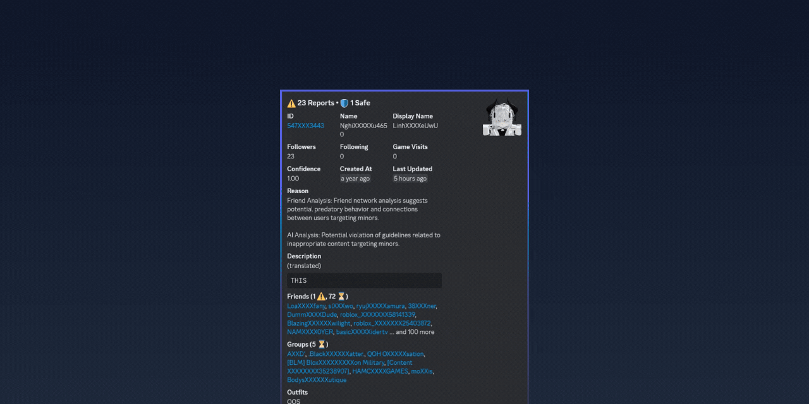

<h1 align="center">
  <picture>
    
  </picture>
</h1>

  From "rob-" (Roblox) and "alexo" (ἀλέξω, to protect and defend) - a dedicated OSS team creating modern technology to build a safer Roblox platform.

  We develop tools for platform security and content moderation, leveraging artificial intelligence to create safer online environments. Our solutions prioritize efficiency and scalability while maintaining high performance standards.

---

## 🚀 Featured Project

<table>
  <tr>
    <td align="center">
      <h1 align="center">
        <a href="https://github.com/robalyx/rotector">
          <picture>
            
          </picture>
        </a>
      </h1>
      
A powerful application designed to assist in identifying inappropriate user accounts on Roblox using AI and smart algorithms. Our goal is to help make the platform safer, especially for young users.

      

        
        
      

    </td>
  </tr>
</table>

---

## 🛠️ Other Projects

<table>
  <tr>
    <td align="center">
      <h1 align="center">
        <a href="https://github.com/robalyx/rotten">rotten</a>
      </h1>
      
A simple command-line tool that lets you check Roblox accounts against Rotector exports. Supports checking individual users, groups, or scanning entire friend lists to avoid association with flagged accounts.

      

        
        
      

    </td>
    <td align="center">
      <h1 align="center">
        <a href="https://github.com/robalyx/roverse">roverse</a>
      </h1>
      
A secure and efficient Cloudflare Worker proxy for Roblox API endpoints. Provides additional security and rate limiting control when making requests.

      

        
        
      

    </td>
  </tr>
</table>

---

## 👥 Core Team

<table>
  <tr>
    <td align="center">
      <a href="https://github.com/jaxron">
         
        <b>jaxron</b>
      </a>
       
      Project Lead
    </td>
  </tr>
</table>

---

  ⭐ If you find our work valuable, consider starring our repositories to show your support!

