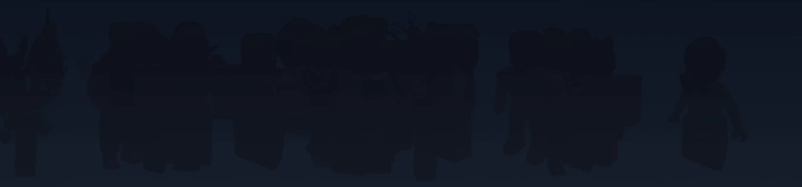
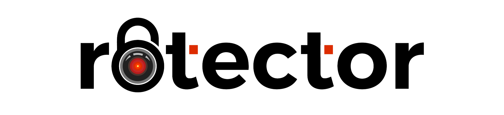

<h1 align="center">
  <picture>
    
  </picture>
</h1>

  From "rob-" (Roblox) and "alexo" (ἀλέξω, to protect and defend) - a dedicated OSS team creating modern technology to build a safer Roblox platform.

  We develop tools for platform security and content moderation, leveraging artificial intelligence to create safer online environments. Our solutions prioritize efficiency and scalability while maintaining high performance standards.

---

## 🚀 Featured Project

<table>
  <tr>
    <td align="center">
      <h1 align="center">
        <a href="https://github.com/robalyx/rotector">
          <picture>
            <source media="(prefers-color-scheme: dark)" srcset="../assets/banner-dark.png">
            <source media="(prefers-color-scheme: light)" srcset="../assets/banner-light.png">
            
          </picture>
        </a>
      </h1>
      
A powerful application designed to assist in identifying inappropriate user accounts on Roblox using AI and smart algorithms. Our goal is to help make the platform safer, especially for young users.

      

        <a href="https://rotector.com"><strong>🌐 Visit Website</strong></a>
      

      

        
        
      

    </td>
  </tr>
</table>

---

## 👥 Core Team

<table>
  <tr>
    <td align="center">
      <a href="https://github.com/jaxron">
         
        <b>jaxron</b>
      </a>
       
      Project Lead
    </td>
  </tr>
</table>

---

  ⭐ If you find our work valuable, consider starring our repositories to show your support!

